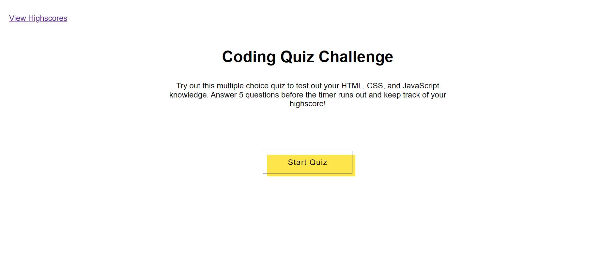
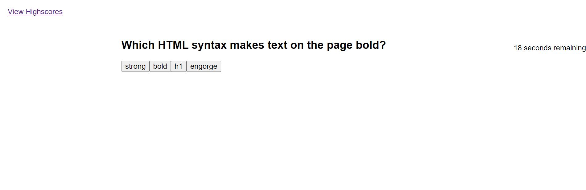
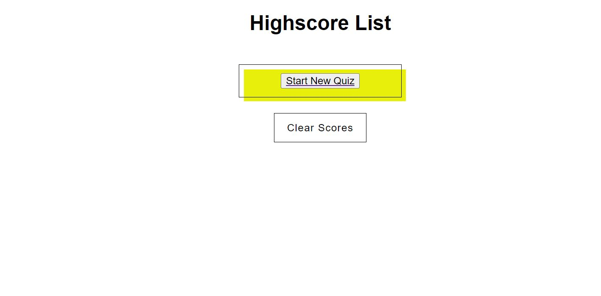

# Quizzle Me This

## User Story

AS A coding boot camp student
I WANT to take a timed quiz on JavaScript fundamentals that stores high scores
SO THAT I can gauge my progress compared to my peers

## Description
Users can come to this site to test their knowledge on Web Development facts. When the user clicks the start quiz button, the first question populates with multiple choice answers. The timer also starts a countdown. When the user clicks the Highscores page, they are taken to another page where they see a list of previous scores and they can potentially add there own or clear the list to start over.

## Preview

